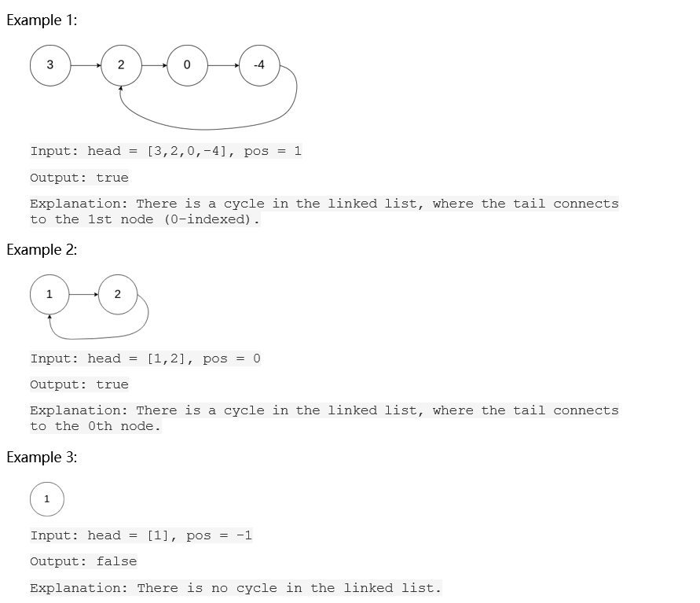

# Question 1

## Details

|Name|Reg-Number|
|----|----------|
|Mark Victor Kithinji| SCT 212-0105/2022|

## Question

Given `head`, the head of a linked list, determines if the linked list has a cycle in it. There is a cycle in a linked list if there is some node in the list that can be reached again by continuously following the next pointer. Internally, `pos` is used to denote the index of the node that tail's next pointer is connected to. Note that `pos` _is not passed as a parameter_.

Return `true` if there is a cycle in the linked list. Otherwise, return `false`.

### Constraints

- The number of the nodes in the list is in the range [0, 104].
- 105 <= Node.val <= 105
- pos is -1 or a valid index in the linked-list.

Follow up: Can you solve it using `O(1)` (i.e. constant) memory?
