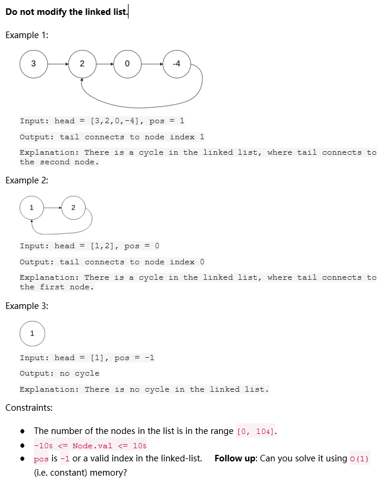

# Question 2

## Details

| Name                 | Reg-Number        |
| -------------------- | ----------------- |
| Mark Victor Kithinji | SCT 212-0105/2022 |

## Question

Given the head of a linked list, return the node where the cycle begins. If there is no cycle, return null. There is a cycle in a linked list if there is some node in the list that can be reached again by continuously following the next pointer. Internally, pos is used to denote the index of the node that tail's next pointer is connected to (0-indexed). It is -1 if there is no cycle. Note that pos is not passed as a parameter.

